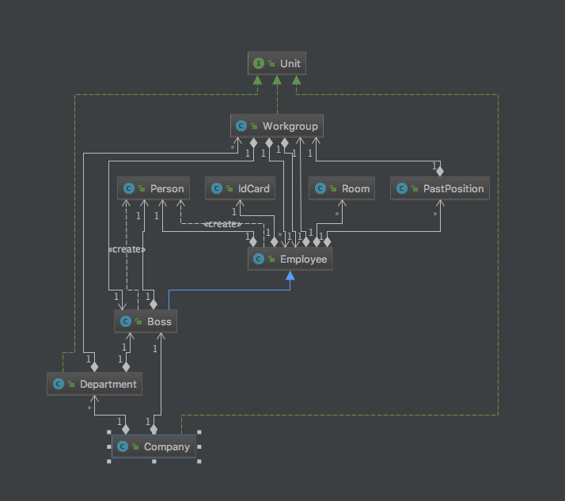
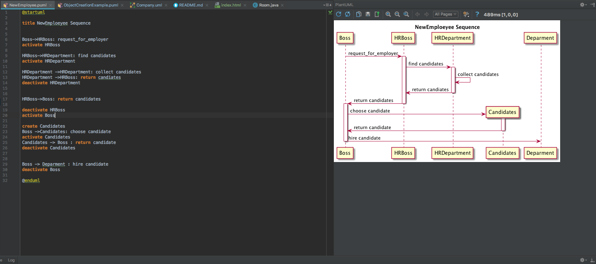
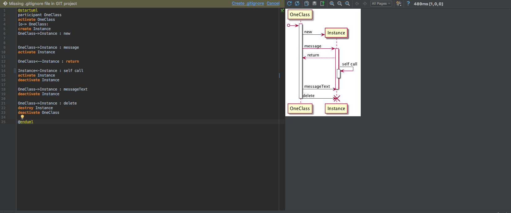

## среда
Intellij IDEA  Ultimate или языковые версии

## Устанавливаем плагины.

Для работы понадобяться плагины:

* UMLSupport
* PlantUML

UMLSupport - стандартный.

PlantUML - скачиваем из репозитория.

## Работаем с  плагинами.

**UMLSupport** - правый клик мыши на классе и *Diagrams->Show Diagramm*. Также открывает uml файлы. В частности Company.uml из корня проекта:
    

**PlantUML** - создает/открывает PUML. Доступ из File/New или контекстное меню.
    Здесь PlantUML используеться для диаграмм последовательностей.  ( [подробнее](http://plantuml.com/sequence-diagram) )
     попробуйте открыть NewEmployee.puml и ObjectCreationExample.puml.
    
    
    *Если в правой панели ничего не рисуется то вам [сюда](http://plantuml.com/graphviz-dot)*

## UML
  [Диаграммы классов](ClassDiagramms.md)
  [Диаграммы последовательностей](SequenceDiagramms.md)